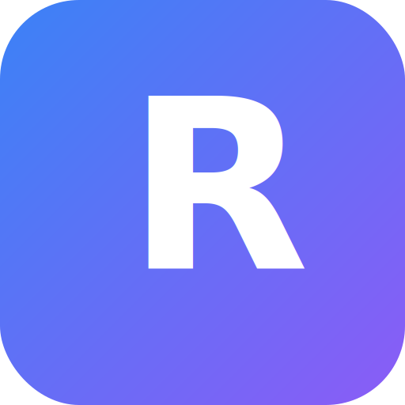

<p align="center">
  
</p>

<h1 align="center">Resulyze</h1>

<p align="center">
  <strong>Paste a job posting. Get a tailored LaTeX resume, cover letter, and interview prep.</strong><br/>
  No sign-up. No tracking. Just your Gemini API key and your browser.
</p>

<p align="center">
  <a href="https://smartresulyze.vercel.app"></a>
  <a href="LICENSE"></a>
  
  
  <a href="CONTRIBUTING.md"></a>
</p>

---

## What is Resulyze?

Resulyze is an AI-powered career toolkit with four tools you can use in any order:

- **Job Analysis** extracts skills, qualifications, and keywords from any job posting. Normalizes 50+ skill aliases and saves your last 5 analyzed JDs for quick switching between roles
- **Resume Editor** gives you a LaTeX editor with live PDF preview and an AI chat assistant that rewrites, optimizes, and scores your resume against the specific job description
- **Cover Letters and Referrals** generates role-specific letters exportable as PDF or plain text. Company-aware tone calibration, achievement cherry-picking from your resume
- **Interview Prep** creates practice questions from the actual job requirements with model answers and company research drawn from the JD context

> **New to LaTeX?** No problem. Just paste your details and let the AI handle the formatting. You get a clean, ATS-friendly resume without writing a single LaTeX command.

Everything runs in your browser. Bring your own Gemini API key.

---

## Features

| Feature | What it does |
|---------|-------------|
| **Template Gallery** | 8 professional LaTeX templates (Modern, Classic, Minimal, Sidebar, Developer, Professional, Bold, Compact) with real compiled PDF previews on the dashboard |
| **Multi-Resume Management** | Create and manage multiple resumes, each with its own version history and chat history. Resume switcher in the editor toolbar |
| **Resume Review** | Scores your resume 0-100 with a letter grade. Section-by-section breakdown of ATS compliance, content quality, and skill match against the job description |
| **ATS Compatibility Score** | Analyzes the compiled PDF via Gemini multimodal, exactly what ATS bots see. Keyword density, formatting, section completeness, and parsability scoring |
| **Weak Bullet Detection** | Flags vague or unquantified bullets and suggests specific AI rewrites with metrics and strong action verbs |
| **Skill Match Panel** | Shows your match percentage against the analyzed job description with color-coded matched and missing skills |
| **AI Chat Assistant** | Chat to rewrite, optimize, and tailor your resume. Intent-aware: understands "too long", "add keywords", "fix verbs", and more |
| **Quick Action Chips** | One-click prompts for common tasks: Review, Add metrics, Make concise, Fix verbs, Match JD |
| **Live PDF Preview** | High-fidelity canvas rendering with zoom, retina support, clickable link annotations, and responsive resizing |
| **Resume Versioning** | Every AI edit is auto-saved with a timestamp. Restore any version in one click |
| **Page Overflow Detection** | Detects when your resume exceeds one page and suggests AI-powered trims to fit |
| **Editor Intelligence** | LaTeX autocomplete, real-time linting, document outline, indent guides, Go to Section palette, diff gutter, and smart editing shortcuts |
| **Analytics Dashboard** | Skill cloud across analyzed JDs, optimization timeline, activity feed, and quick action cards with usage stats |
| **JD History** | Last 5 analyzed job descriptions are saved. Preview, delete, or switch between them |
| **Code Search** | Find and replace across your LaTeX source with case, regex, and whole-word filter support |
| **Keyboard Shortcuts** | `Ctrl+Enter` to compile, `Ctrl+Shift+L` to toggle AI chat, `Ctrl+Shift+O` for Go to Section |
| **Persistent State** | Resume, job data, chat history, and preferences all survive page refreshes via localStorage |
| **PDF and Text Export** | Download resumes and cover letters as PDF or plain text |
| **Mobile Responsive** | Full access on mobile: editor, review panel, and chat open as a bottom sheet overlay |

---

## Quick Start

```bash
git clone https://github.com/vanshaj-pahwa/resulyze.git
cd resulyze
npm install
npm run dev
```

Open [localhost:3000](http://localhost:3000). Enter your Gemini API key in the browser. That's it.

> Get a free key at [Google AI Studio](https://aistudio.google.com/apikey)

---

## Tech Stack

| | |
|---|---|
| **Framework** | Next.js 14 (App Router) |
| **Language** | TypeScript 5 |
| **UI** | React 18, Radix UI, Tailwind CSS |
| **Editor** | CodeMirror 6 (LaTeX syntax, autocomplete, linting) |
| **PDF** | pdf.js, jsPDF |
| **AI** | Google Gemini API (gemini-2.0-flash) |
| **Rich Text** | Tiptap |

---

## BYOK (Bring Your Own Key)

Your Gemini API key stays in your browser. It is sent directly to Google's API from the client. Resulyze never stores, logs, or proxies your key. Your resume, job descriptions, and chat history are stored exclusively in localStorage and never leave your device.

---

## Contributing

Contributions are welcome. See [CONTRIBUTING.md](CONTRIBUTING.md) for guidelines.

## License

[MIT](LICENSE) &copy; Vanshaj Pahwa
